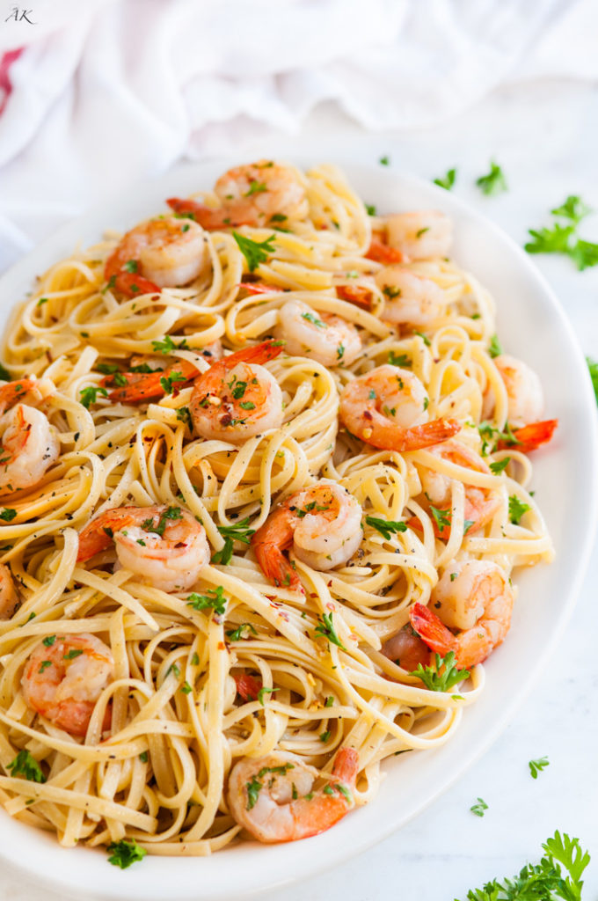
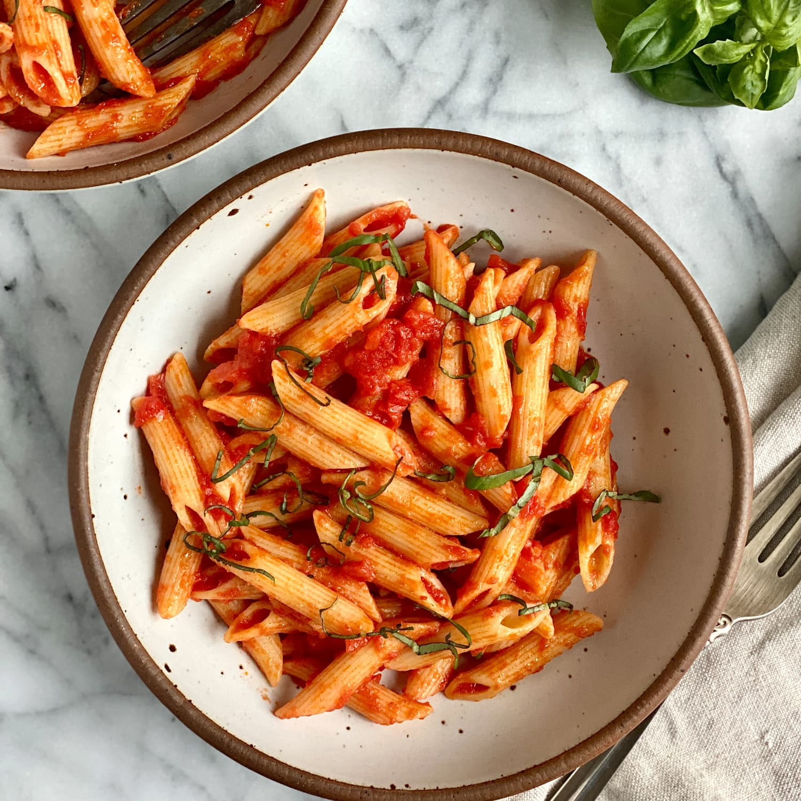
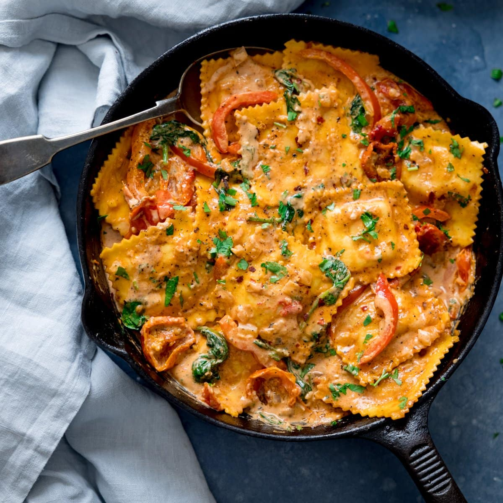
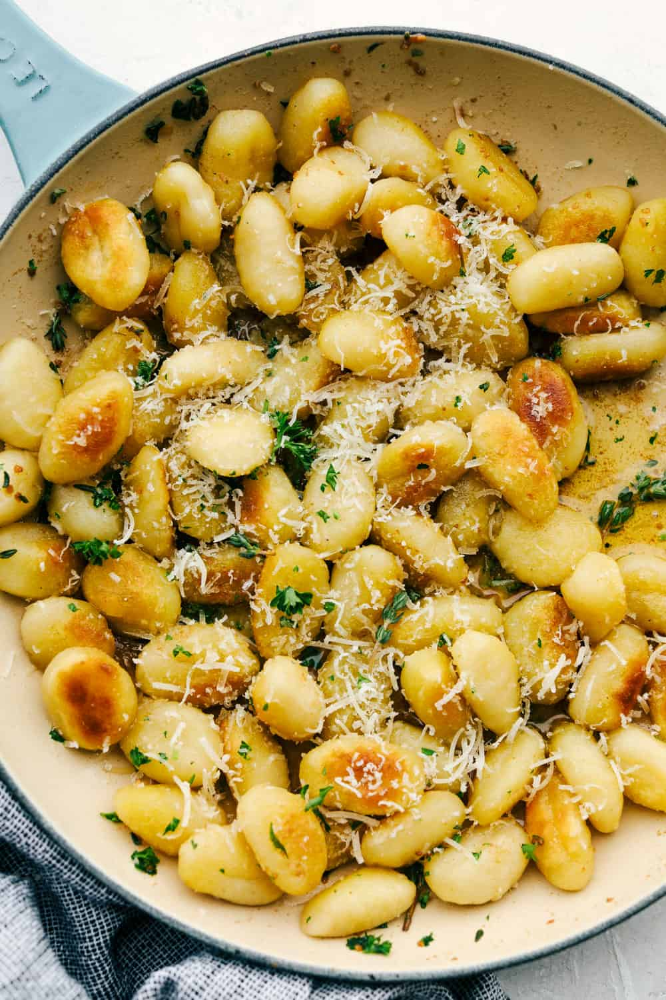
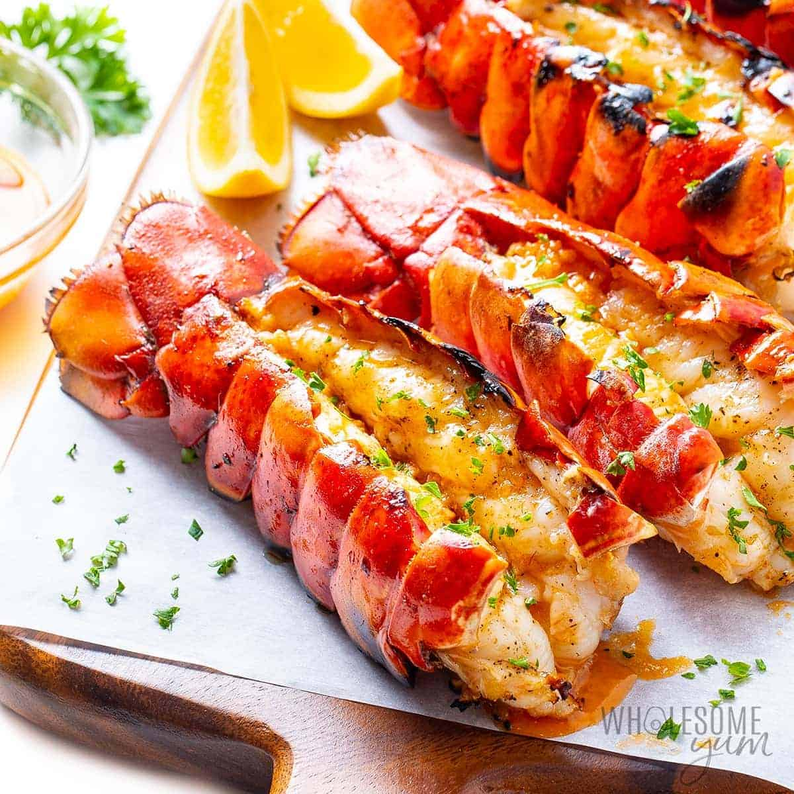
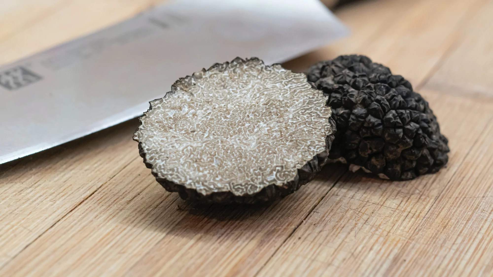
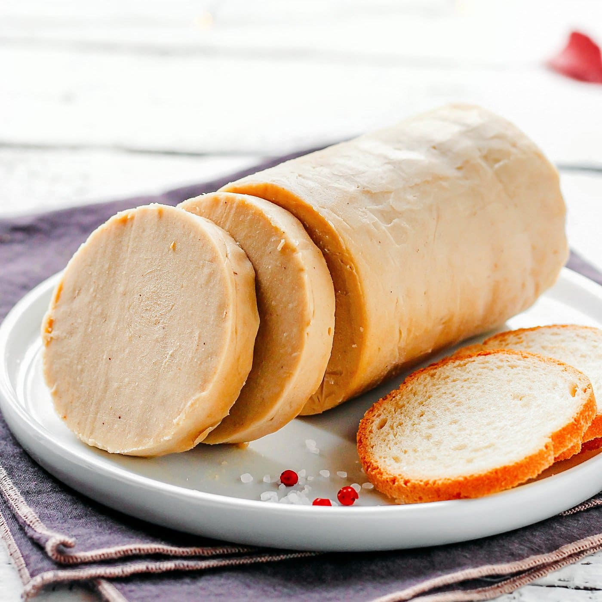

<head>
  <meta charset="UTF-8">
  <meta http-equiv="X-UA-Compatible" content="IE=edge">
  <meta name="viewport" content="width=device-width, initial-scale=1.0">
  <link rel="preconnect" href="https://fonts.gstatic.com">
  <link href="https://fonts.googleapis.com/css2?family=Inter:wght@400;700&display=swap" rel="stylesheet">
  <link rel="stylesheet" type="text/css" href="style.css">
  <meta name="viewport" content="width=device-width, initial-scale=1.0">
</head>

<body>
  
  

    

      <h2 class="menu-group-heading">
        Des Pâtes
      </h2>
      

        

          
          

            <h3 class="menu-item-heading">
              Rigatoni
              $19.99
            </h3>
            

             Le rigatoni est servi avec le pesto rouge. La pesto a des noix, fromages, ails, tomates et épices. Le plat est garni de sel truffe.
            

          

        

        

          
          

            <h3 class="menu-item-heading">
              Linguini
              $21
            </h3>
            

             Le linguini est servi avec des crevettes et la sauce au beurre. Le plat est garni de persil.
            

          

        

                  

          
          

            <h3 class="menu-item-heading">
              Penne
              $15
            </h3>
            

              Le penne est servi avec la sauce marinara. Le sauce a du parmesan, des ail, et des tomates d'Italie! Le plat est garni de basilic. 
            

          

        

        

          
          

            <h3 class="menu-item-heading">
              Spaghetti
              $20
            </h3>
            

            Le spaghetti est servi avec les boulette de viande et la sauce marinara. Le sauce a des ail, et des tomates d'Italie! Le plat              est              garni de basilic et de parmesan. 
            

          

        

                

          
          

            <h3 class="menu-item-heading">
              Ravioli
              $21
            </h3>
            

              Le ravioli est servi avec la sauce marinara crémeuse. La plat est garni de parmesan et de basilic. 
            

          

        

                

          
          

            <h3 class="menu-item-heading">
              Gnocchi
              $18
            </h3>
            

              Le gnocchi est servi avec le beurre noisette. La variété des herbes rend ce plat très deliceux. La plat est garni de ail frit.
            

          

        

      

      <h2 class="menu-group-heading">
        Les Spécialités
      </h2>
      

        

          
          

            <h3 class="menu-item-heading">
              Homard
              $50
            </h3>
            

          Homard au beurre noisette avec vos pâtes. Extrêmement riche, gras et savoreux!
            

          

        

        

          
          

            <h3 class="menu-item-heading">
              Truffes
              $30
            </h3>
            

              Les truffes d'hiver rappées sur vos pâtes.
            

          

        

        

          
          

            <h3 class="menu-item-heading">
              Foie Gras
              $30
            </h3>
            

           Foie Gras tranché et grillé sur vos pâtes.
            

          

        

      

    

  

</body>
